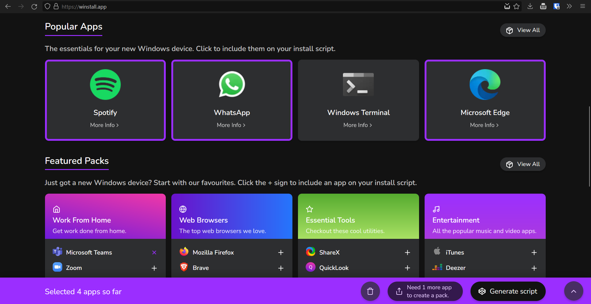
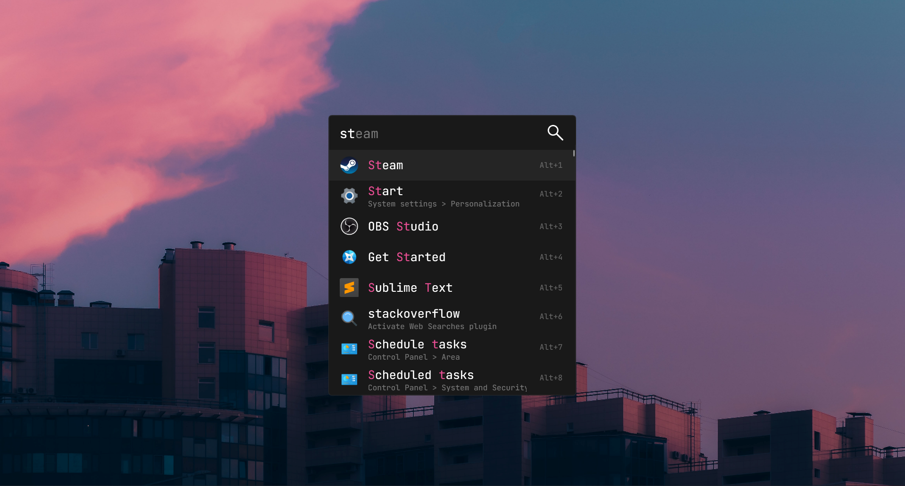
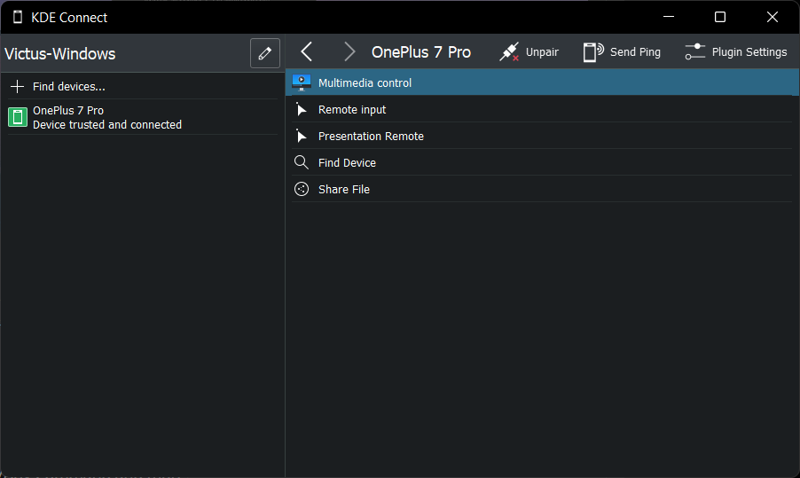
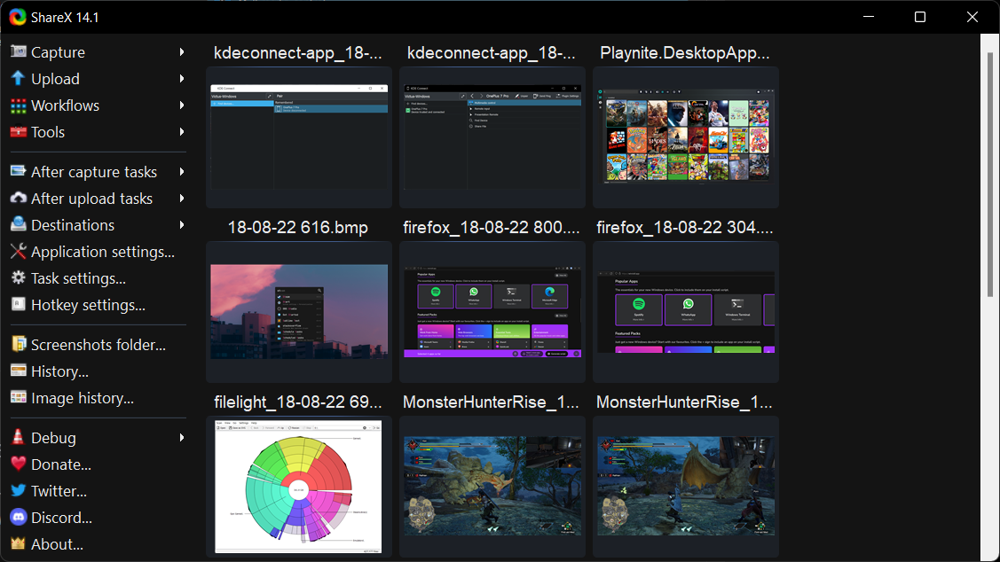
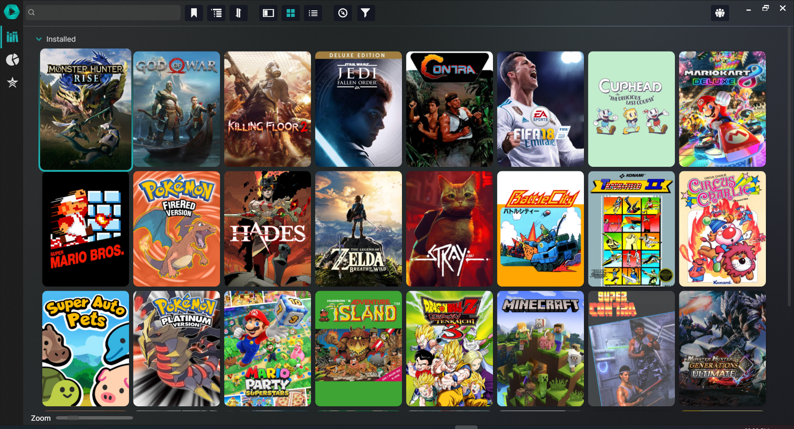
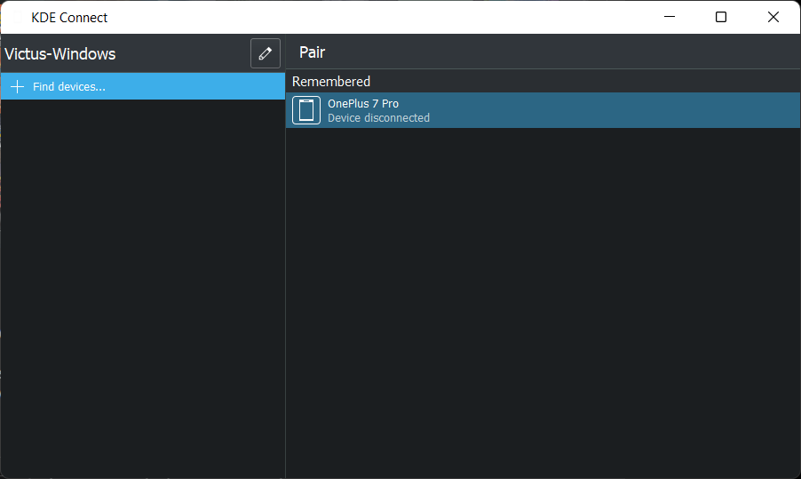
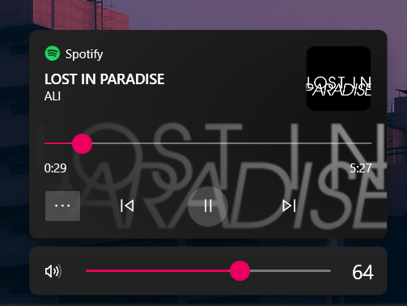
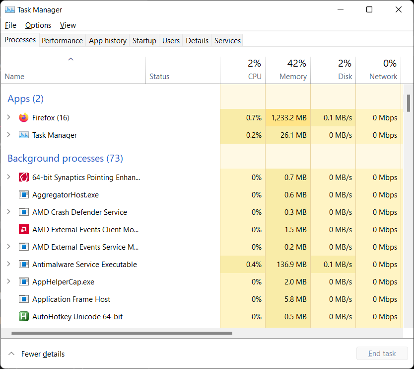
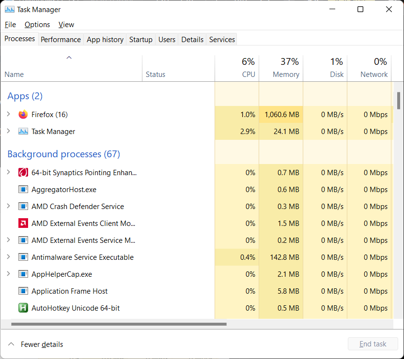

## Winget (Better than Ninite)

Terminal application manager for windows. If you don't want to bother too much with the terminal

1. Go to [winstall.app](https://winstall.app) and add as many apps as you want.
2. Click generate script, select powershell, copy the code.
3. Open powershell and copy paste. 
 
 I have my script saved on a notepad incase I have to reset windows or set up a new PC, turns something that takes hours into something that takes minutes.

# [Filelight (Better than WinDirStat)](https://www.microsoft.com/store/apps/9PFXCD722M2C)

It is open source (Made by KDE Devs), faster and better looking.

[You can hover over each subsection to get more details.](./Images/2.png)

# [Flow Launcher (Better than windows search)](https://www.flowlauncher.com/)

Open source, looks better, searches your apps, settings, control panel AND google instead of bing, gives better results and allows blacklisting and alot more.

# [KDE Connect (Better than Phone Link)](https://www.microsoft.com/store/apps/9N93MRMSXBF0)

Well better for Non Samsung users. Gives you

* Notifications
* Air Drop
* Clipboard Sync
* Remote Shutdown/Any Command and more.

# [ShareX (Better Than Clipping Tool)](https://getsharex.com/)

Has more options, has the ability to only copy to clipboard and not save. Is what I'm using to write this right now.

# [Playnite (Better than Steam/Gog Galaxy IMO)](https://playnite.link/)

* open-source, 
* supports theming, 
* automatic metadata serach,
* supports multiple stores, 
* has emulation support out of the box 
* and huge plugin library for extra functionality.

f)

# [Mica For Everyone (Better Than Windows)](https://github.com/MicaForEveryone/MicaForEveryone/releases)

Adds Black/White Titlebars based on your theme choice or manual choice. Using Mica causes artifcats for now but that's on MS apparently.

# [ModernFlyouts (Better Than Windows)](https://www.microsoft.com/store/apps/9MT60QV066RP)

Better Volume/Key Notification. IT ALSO TELLS YOU IF YOUR NUM LOCK IS ON. Underrated.

# Will My PC Burn Keeping So Many Things in the Background?

I can't close Firefox or I'll lose my post sorry :(. Also ShareX for SS (Takes about 1%)

Disclaimer: I have 16 GB DDR4 Memory and I have only closed the utilities mentioned in this post.

